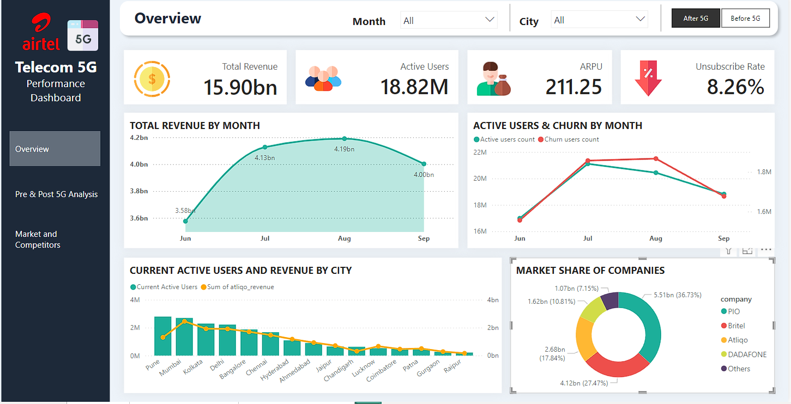
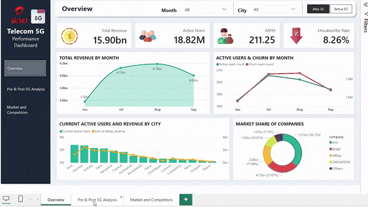

### Project Overview: 5G KPI Dashboard for Airtel India

**Project Scope:**  
This project centers on developing a Power BI dashboard to analyze the key performance indicators (KPIs) for Airtel India's 5G services. The focus is on understanding performance shifts since the launch of 5G services, with insights drawn from real-time data under a non-disclosure agreement (NDA) with Airtel India. For demonstration purposes, AtliQo data is used as a placeholder.

**Project Goals:**  
- Create a comprehensive Power BI dashboard to visualize and compare KPIs before and after the launch of 5G services.
- Provide actionable insights to Airtel India's management to enhance user retention, revenue, and overall performance.

**Dashboard Preview:**

**Key Metrics Analyzed:**  
- **Revenue Overview:** Total revenue of ₹31.87 Billion from January to September, with a focus on revenue trends and growth.
- **User Engagement:** Active user count of 18.82 Million as of September, with analysis of user retention and churn rates.
- **Revenue Per User:** Average revenue per user (ARPU) reported at ₹200, with pre- and post-5G comparison.
- **Churn Rate:** Elevated churn rate over 7%, with a detailed examination of its impact post-5G launch.

**Detailed Insights:**  
- **Financial Impact:** A slight reduction of 0.5% in average revenue post-5G, contrasted with an 11% increase in ARPU.
- **User Trends:** A notable 12% drop in active users after the 5G launch, with a monthly churn rate rising to 23.5%.
- **City-Level Data:** Significant user growth in Pune and Chandigarh, but substantial declines in cities like Coimbatore.
- **Churn by Region:** Highest churn rates observed in Lucknow (78%) and Pune (55%).

**Competitive Analysis:**  
- **Market Share:** Airtel India commands 17.84% market share, ranking third after PIO (36.73%) and Britel (27.42%).
- **Growth Rate:** Airtel India exhibits a 10% slower growth rate compared to competitors.

**Outcome:**  
The dashboard will empower Airtel India's leadership to make data-driven decisions to mitigate churn, optimize 5G offerings, and enhance market competitiveness.

Sample Preview:

